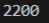
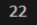
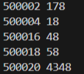

## Лабораторная работа №2

## Задание 1
В модуле itertools использовала функцию product для составления слов с повторяющимися буквами, в список а добавила все получившиеся слова , через цикл for if отсеяла не попадающиеся под условия слова, добавила счетчик cnt и увеличивала его каждый раз когда слово подходило под условие.
## Результаты вычислений

## Задание 2
Создала список s, через цикл while представила число в системе счисления 5, перевернула число для точности и через count посчитала все 4.
## Результаты вычислений

## Задание 3
Через первый цикл for if  перебрала числа которые больше 500000 и чтобы их было 5, через второй цикл for if который внутри первого, нашла делители для каждого числа которые заканчиваются на 8.
## Результаты вычислений

## Список использованных источников:
1. [for if в Python](https://py3dev.ru/bop/control_flow/)
2. [itertools](https://docs.python.org/3/library/itertools.html)
