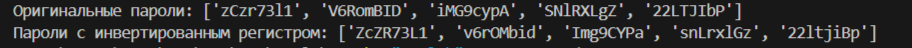

## Лабораторная работа №5

## Задание 1
Я написала программу на Python для генерации паролей. Сначала подключила модули random и string, чтобы работать со случайными символами. Создала функцию generate_password, которая генерирует пароль из букв и цифр заданной длины. Затем добавила функцию invert_case, которая меняет регистр букв.
Сгенерировала список из 5 паролей и с помощью map применила invert_case к каждому паролю. Генераторная функция generate_passwords создает пароли с помощью yield, что позволяет возвращать их по одному,не завершая работу функции.

## Результаты вычислений

## Список использованных источников:
1. [Функция map](https://docs.python.org/3/howto/functional.html)
2. [Как работает yield](https://www.google.com/url?sa=t&source=web&rct=j&opi=89978449&url=https://sky.pro/wiki/python/chto-takoe-yield-v-python-i-kak-ego-ispolzovat/&ved=2ahUKEwj5tZyGvIaMAxVRIBAIHZpUIGAQFnoECBUQAQ&usg=AOvVaw39LaXeVkdZrkvWhfdnYQF3)
