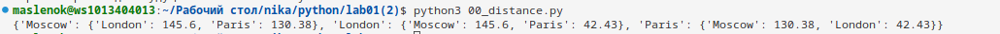
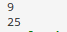
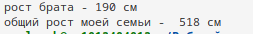
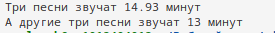
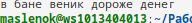
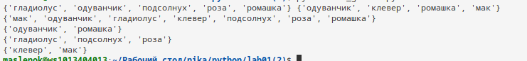
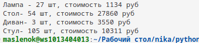

# Лабораторная работа №1

## Задание 0
с помощью round() округляем расстояние, а с помощью for if высчитываем разницу расстояний.
## Результаты вычислений

## Задание 1
с помощью round() округляем расстояние, а с помощью for if высчитываем разницу расстояний.

## Результаты вычислений

## Задание 2
расставила знаки так, что бы получилось число 25 не переставляя числа

## Результаты вычислений

## Задание 3
указанные фильмы расставила в порядке используя срезы []

## Результаты вычислений

## Задание 4

чтобы вывести рост отца и общий рост без запятых использовала print дважды и срезы
## Результаты вычислений

## Задание 5
чтобы поместить медведя в определенное место использовала функцию .insert(), чтобы указать место в списке куда хочу поместить медведя, указала животного после которого будет стоять медведь. чтобы добавить птиц из списка в другой список без скобок, использовала функцию .extend(). Для того чтобы убрать кого то из списка - .remove(). Чтобы узнать под каким номером кто сидит в клетке использовала функцию .index()

## Результаты вычислений

## Задание 6
чтобы узнать общее время звучания песен нужно использовать срезы и сложить их, а затем вывести с помощью round()

## Результаты вычислений

## Задание 7
чтобы расшифровать слово с использованием подсказок, нужны срезы

## Результаты вычислений

## Задание 8
с помощью функции set() сортирую цветы, чтобы они не повторялись, & для того чтобы найти совпадающие цветы и там и там.

## Результаты вычислений

## Задание 9
Шопинг. Создала список со сладостями с 2-мя магазинами с минимальными ценами.

## Результаты вычислений

## Задание 10
Магазин. Самое объемное задание, в переменных чтобы полностью не писать диван и стул сократила их до первой буквы. У разных штук мебели разная цена, поэтому везде считала все по отдельности,умножала:(

## Результаты вычислений

## Шпаргалка по работе с git:
git clone - для клонирования существующего репозитория Git. 
git add - добавляет содержимое рабочей директории в индекс для последующего коммита. 
git commit -m "" - позволяет добавить однострочное сообщение при создании коммита в репозитории. 
git push - это консольная команда, которая передаёт в удалённый репозиторий изменения, сделанные в локальном репозитории.
## Список использованных источников:

1. [Списки Python](https://www.google.com/url?sa=t&source=web&rct=j&opi=89978449&url=https://ru.hexlet.io/courses/python-lists/lessons/slices/theory_unit&ved=2ahUKEwiBwJf82NGLAxUDFhAIHWNVJG8QFnoECAgQAQ&usg=AOvVaw04PHpUJlg_yRZS2gZGXizl)
2. [Python](https://www.google.com/url?sa=t&source=web&rct=j&opi=89978449&url=https://www.reg.ru/blog/shpargalka-po-python-dlya-django/&ved=2ahUKEwiuwM-M2dGLAxXzEBAIHU9GBjoQFnoECBUQAQ&usg=AOvVaw0wA2CVpRX0w7K9SHJQyGnH)
