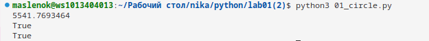
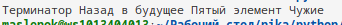
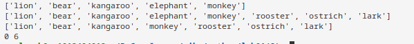

# Лабораторная работа №1

## Задание 0

## Результаты вычислений

## Задание 1

## Результаты вычислений

## Задание 2

## Результаты вычислений

## Задание 3

## Результаты вычислений

## Задание 4

## Результаты вычислений

## Задание 5

## Результаты вычислений

## Задание 6

## Результаты вычислений

## Задание 7

## Результаты вычислений

## Задание 8

## Результаты вычислений

## Задание 9

## Результаты вычислений

## Задание 10

## Результаты вычислений

## Список использованных источников:

1. [Matplotlib cheatsheets and handouts](https://matplotlib.org/cheatsheets/)
2. [Markdown Cheat Sheet](https://www.markdownguide.org/cheat-sheet/)
3. [Writing mathematical expressions](https://docs.github.com/en/get-started/writing-on-github/working-with-advanced-formatting/writing-mathematical-expressions)